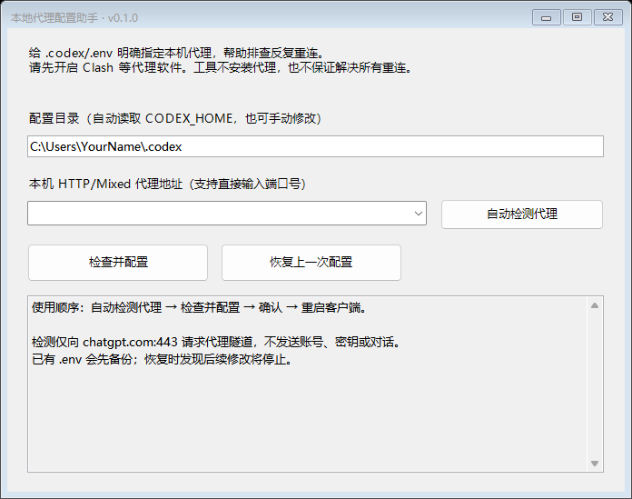

# 本地代理配置助手

在 Windows 上使用 Codex 时，如果新会话的第一条消息总要“正在重新连接”几次才能回复，可以尝试为客户端单独设置代理。

这个小工具把手动编辑 `.env` 的过程做成了图形界面：检测本机代理，确认后写入配置，同时备份原文件，方便恢复。使用 Windows 自带的 PowerShell 运行，解压后双击 `Start.cmd` 即可打开。



## 使用前准备

- **系统：** Windows 10 / 11，保留系统自带的 Windows PowerShell 5.1。
- **代理：** 先打开 Clash Verge 等代理软件，确认本机 HTTP 或 Mixed 端口可用。仅有 SOCKS 端口时不能使用本工具。
- **客户端：** 适用于读取 `.codex/.env` 的 Codex 客户端版本，并非所有 ChatGPT 桌面版都适用。

当前版本为 `v0.1.0` 预发布版，尚未完成各客户端版本的兼容性验证。本工具用于处理代理配置问题；服务故障、节点不可用等原因造成的重连，还需要另行排查。

## 使用方法

1. 下载并解压，双击 `Start.cmd`。请先解压完整文件夹，不要直接在压缩包里运行。
2. 程序会自动检测代理。核对界面中的配置目录和代理地址，点击 **“检查并配置”**，确认后写入。
3. 完全退出 Codex，再重新打开，新建会话发送一条消息，看看是否还会重连。

如果没有检测到代理，可在输入框中填写代理软件的 **HTTP/Mixed 端口号**，例如 `7897`，也可以填写完整地址 `http://127.0.0.1:7897`。

默认配置目录为 `C:\Users\你的用户名\.codex`。设置过 `CODEX_HOME` 的用户，程序会读取该变量指定的目录；目录不对时，可以在界面中修改。

配置后请保持代理软件运行。如果以后更换了代理端口，重新运行本工具更新配置即可。

## 配置内容

以本机 `7897` 端口为例，程序会在配置目录的 `.env` 文件中写入：

```dotenv
HTTP_PROXY="http://127.0.0.1:7897"
HTTPS_PROXY="http://127.0.0.1:7897"
NO_PROXY="localhost,127.0.0.1,::1"
```

前两行指定代理地址，最后一行让访问本机的连接不经过代理。已有 `NO_PROXY` 内容会保留，并补上这些本机地址。

修改前会备份原文件，其他配置项会保留。程序只调整这里的代理变量，不改系统代理或 `config.toml`，也不会替你关闭客户端。相同配置重复执行时，不会额外生成备份。

## 恢复原配置

点击 **“恢复上一次配置”**，即可撤销最近一次由本工具完成的修改。原来有 `.env`，就还原原文件；原来没有，则删除本工具创建的文件。恢复后同样需要重启客户端。

如果 `.env` 在配置后又被其他程序或手动修改过，工具会停止自动恢复，避免覆盖新内容。此时可到配置目录下的 `proxy-helper-backups` 文件夹查看备份，手动核对需要恢复的设置。备份损坏或校验不通过时，也不会继续恢复。

**备份可能含有原配置中的密钥，请留在本机，不要上传到仓库或作为问题附件。**

## 常见问题

**没有检测到代理**

先确认代理软件已启动，再查看它的 HTTP/Mixed 端口。自动检测只检查部分常用端口，其他端口需要手动填写。当前仅支持本机代理，不支持远程地址或需要账号密码的代理。

**提示配置成功，仍然重连**

先确认客户端已经完全退出并重新启动，再检查代理节点是否可用。程序的连接检查只能确认代理接受了到 `chatgpt.com:443` 的连接请求，不能据此判断登录或消息发送一定正常。

**提示拒绝访问、文件格式不支持，或恢复失败**

请按窗口提示检查配置目录和文件。对于特殊编码、跨行配置、符号链接等情况，程序会停止自动修改，需要手动处理。修改期间，也请避免其他程序同时编辑 `.env`。

<details>
<summary>更多配置细节</summary>

- 自动检测会读取代理环境变量和已启用的 Windows 手动代理设置，再尝试本机常用端口 `7897`、`7890`、`10809`、`8080`。检测可能需要几秒钟，请等待完成。
- 支持的本机地址为 `localhost`、`127.0.0.1` 和 `::1`。检测只发送 HTTP CONNECT 请求，不读取账号认证文件，也不发送密钥或对话内容。
- `.env` 需为 UTF-8 编码。程序会合并大小写不同或重复的代理变量，保留其他配置及独立的注释行；被替换代理行的行尾注释不会保留，文件末尾的空行可能有所调整。
- 已有 `ALL_PROXY`、`WS_PROXY`、`WSS_PROXY` 会保留。它们与新配置的优先级由客户端决定。`NO_PROXY=*` 等原有规则也会保留，可能让请求跳过代理。
- 通过 `Start.cmd` 启动时，执行策略调整仅对本次 PowerShell 进程有效，不会永久修改系统设置。单位设备有管理策略时，应按所在单位的要求处理。
- 配置和备份均保存在本机，备份不会自动清理。

</details>

## 问题反馈

遇到问题可以提交 Issue。请附上 Windows 版本、客户端版本、代理软件及端口类型，以及具体的报错文字。提交前请删去账号、密钥等敏感信息。

## 参考与许可

配置思路参考：[解决 ChatGPT 首次发信息“正在重新连接 1/5”问题](https://blog.csdn.net/weixin_42292229/article/details/163091733)。

相关文档：[客户端配置](https://learn.chatgpt.com/docs/config-file/config-basic)、[客户端与工具的网络设置](https://learn.chatgpt.com/docs/permissions#what-the-network-proxy-does-not-control)。

作者：[Tywin Niu](https://github.com/max-niuniu) · [MIT License](LICENSE)

本项目为第三方工具，与客户端厂商无隶属关系。
